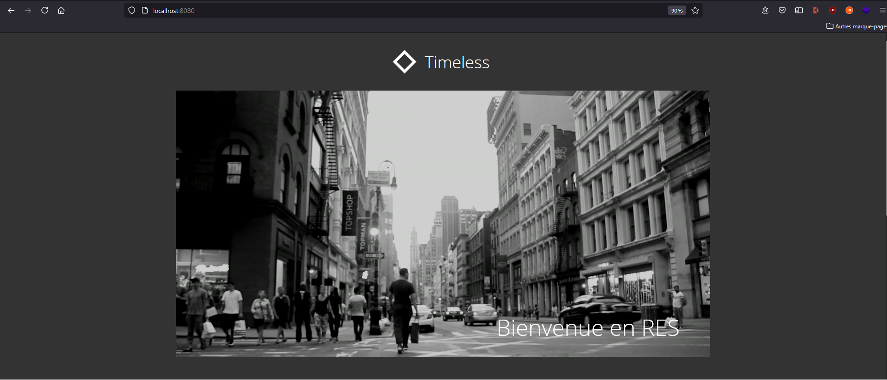
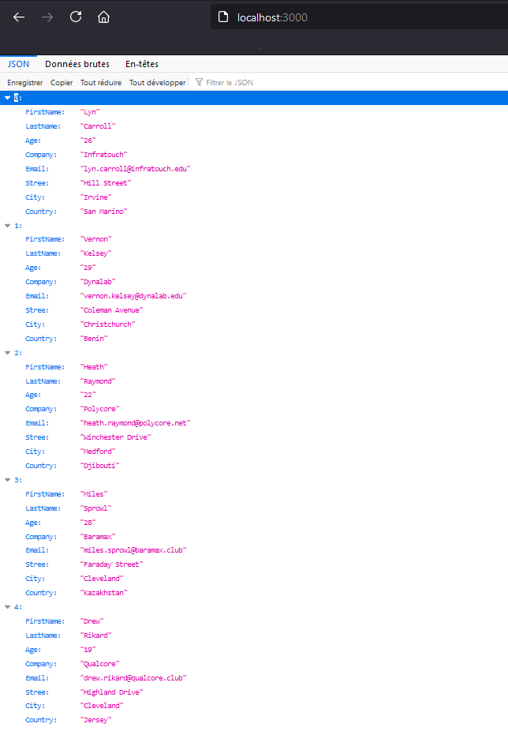
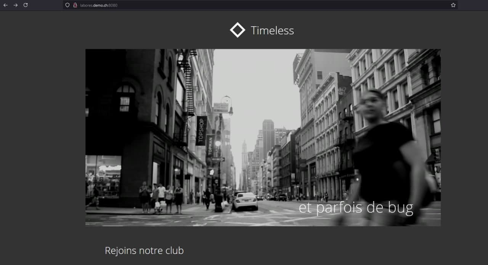
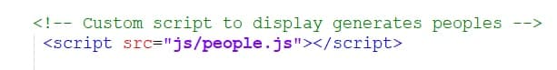
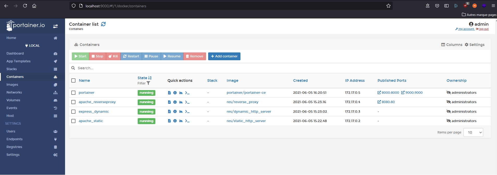

# Teaching-HEIGVD-RES-2021-Labo-HTTPInfra

Auteurs : Christian Gomes & Johann Werkle

Date : 05.06.2021

## Introduction

Ce présent document décrit le travail que nous avons effectué concernant le laboratoire **Teaching-HEIGVD-RES-2021-Labo-HTTPInfra**.

Il y est question d'utilisation, de manipulation et de gestion du protocole HTTP sous ses formes les plus communes, de l'affichage de données textuelles statiques à l'installation et la gestion d'un reverse proxy et des connexions à celui-ci.

Notez au passage que la totalité des images Docker référencées dans ce laboratoire se trouve dans le dossier **docker_images** présent lui-même à la racine du projet.

Nous vous souhaitons une bonne lecture.

## Etape 1: Static HTTP server with apache httpd

Cette étape consiste en la création d'un serveur HTTP statique. Le but est de dockériser une image apache, où nous avons décidé d'utiliser la version 8.0. Nous sommes partis d'une image php trouvée sur le site dockerhub. 

Le dossier **Static_HTTP_Server** contient les fichiers nécessaires à cette partie. 

Le dossier **src** contient les fichiers nécessaires pour la page html qui sera copiée dans le répertoire /var/www/html du container.

Deux scripts sont présents afin de lancer l'image : 

`build_image_docker.sh` permet de build l'image avec un tag défini. 

```bash
docker build --tag  res/static_http_server .
```

`run_docker.sh` permet de démarrer en background le container. 

```bash
docker run -d --name apache_static res/static_http_server
```

Pour la partie 1 et afin de faciliter l'accès à la page HTML que nous avons modifié pour la démonstration, on peut lancer le script de cette manière et accéder en `localhost` sur le port `8080`. 

```bash
docker run -d -p 8080:80 --name apache_static res/static_http_server
```

**Exemple :** 



## Etape 2: Dynamic HTTP server with express.js

Cette étape consiste à la création d'un serveur HTTP dynamique avec l'utilisation du framework express.js qui est utile à la construction d'applications web basées sur node.js. L'objectif est de retourner une liste aléatoire d'objets en json qui seront utilisés lors des prochaines étapes. Nous utilisons dans le Dockerfile la dernière image de node avec node:latest.

Nous avons utilisé **dummy-json** pour cela. Plus d'informations sur ce lien https://github.com/webroo/dummy-json 

On génère simplement 5 personnes avec les données "Firstname,Lastname,Age,Company,Email,Street,City et Country" en json. 

Le dossier **Dynamic_HTTP_Server** contient les fichiers nécessaires à cette partie. 

Le dossier **src** contient les fichiers nécessaires qui seront copiés sur le container pour la génération de cette page. 

Deux scripts sont présents afin de lancer l'image : 

`build_image_docker.sh` permet de build avec un tag défini. 

```bash
docker build --tag  res/dynamic_http_server .
```

`run_docker.sh` permet de démarrer en background le container. 

```bash
docker run -d --name express_dynamic res/dynamic_http_server
```

Pour la partie 2 et afin de faciliter l'accès aux données que nous générons pour la démonstration, on peut lancer le script de cette manière et accéder en `localhost` sur le port `3000`.

```bash
docker run -d -p 3000:3000 --name express_dynamic res/dynamic_http_server
```

**Exemple :** 




## Step 3: Reverse proxy with apache (static configuration)

Cette étape consiste à la création d'un reverse proxy dont le but est de donner accès au serveur statique et au serveur dynamique. L'objectif par rapport aux deux étapes précédentes est de ne pas utiliser de port mapping pour l'accès au container mais uniquement le reverse proxy.

Pour la configuration du lien `labores.demo.ch` , il est nécessaire d'aller modifier dans le fichier hosts la redirection du lien `labores.demo.ch` qui correspond à l'adresse `127.0.0.1` avec l'utilisation de Docker Desktop. 

L'accès aux étapes 1 et 2 se fera grâce au lien `labores.demo.ch` qui a été configuré pour accéder à la partie : 

Statique via : [labores.demo.ch:8080/](labores.demo.ch:8080/)

Dynamique via : [labores.demo.ch:8080/api/people/](labores.demo.ch:8080/api/people/)

Le dossier **Reverse_Proxy** contient les fichiers nécessaires à cette partie. 

Le dossier **conf** contient la configuration nécessaire au proxy notamment avec le fichier `001-reverse-proxy.conf` 

**Remarque :**  Les adresses IP sont hardcodées dans le fichier de configuration, il est donc nécessaire de vérifier qu'au lancement des containers, celle-ci correspondent bien aux fichiers de configuration. 

Le script `./lauchReverseProxy_withAll.sh` se charge de lancer les containers dans l'ordre prévu (à lancer depuis le dossier **docker_images**)

Pour la démonstration il suffit de lancer ce script.

**Exemple :** 




## Step 4: AJAX requests with JQuery

Cette étape consiste à l'ajout d'un script javascript afin que, dans la page html, des données soient générées et affichées toutes les 5 secondes. Nous affichons simplement nom, prénom , âge et adresse mail d'une personne générée aléatoirement.

Nous avons donc dû effectuer les travaux suivants :   

Dans le dossier **Static_HTTP_Server/src**, modification du fichier index.html afin d'inclure le script `js/people.js.`



Dans le dossier **Static_HTTP_Server/src/js**, réalisation du script `people.js`. 

**Exemple :** 


## Step 5: Dynamic reverse proxy configuration

Cette partie concerne le problème d'adresse IP hardcodée qui n'est pas viable dans un environnement de production. Nous voulons changer les adresses IP, sans avoir à trop reconfigurer les éléments déjà en place. Pour cela, nous utilisons un système de variables environnement qui, lors du lancement du container, nous permet d'indiquer clairement les adresses utiles. Nous utilisons toujours une image `php:apache` version 8.0 

Dans l'étape précédente, la configuration du reverse proxy s'est faite dans le fichier `001-reverse-proxy.conf`. Nous allons donc créer ce fichier de configuration à l'aide d'un script php. 

Ce fichier se trouve dans Reverse_Proxy/template/config-template.php. Celui-ci va permettre de récupérer les variables d'environnement crées au moment du lancement du container. 

Le Dockerfile configure le container Docker en copiant les fichiers utiles dans le container afin que la configuration du serveur apache soit adéquate.

## Bonus : Management UI 

En faisant quelques recherches sur internet, nous sommes tombés sur Portainer, une interface web de gestion de containers Docker. Nous avons alors décidé d'utiliser cette plateforme pour le management UI. 

Pour commencer, il faut : 

- Pull l'image portainer via la commande :

  ```shell
  docker pull portainer/portainer-ce
  ```

- Lancer la commande 

  ```shell
  docker run -d -p 8000:8000 -p 9000:9000 --name=portainer --restart=always -v /var/run/docker.sock:/var/run/docker.sock -v portainer_data:/data portainer/portainer-ce
  ```

- Lancer l'interface web via [localhost:9000](localhost:9000)

Et nous avons ainsi accès en webapp à la plateforme qui nous donne quantité de fonctionnalités pour manipuler les différents containers/images. 



## Bonus : Load balancing - multiple server nodes 

Pour réaliser le load balancing sur notre serveur apache, la documentation sur le lien suivant nous indique les principales informations : 

https://httpd.apache.org/docs/2.4/fr/mod/mod_proxy_balancer.html

Dans notre cas, il a fallu modifier quelques fichiers : 

Le Dockerfile du reverse_proxy avec l'ajout de deux modules

> RUN a2enmod proxy proxy_http **proxy_balancer** **lbmethod_byrequests**

**Remarque :** `lbmethod_byrequests` a du être ajouté suite à une erreur présente dans les logs. Ce module n'a pas l'air nécessaire dans toutes les versions d'apache. Dans notre cas, nous utilisons la version 8.0 

Le fichier `apache2_foreground` a été modifié afin d'ajouter en `echo` les variables d'environnement. 

Pour prendre en compte l'ajout du module `proxy_balancer` , nous avons modifié le template de configuration avec l'ajout de la lecture des variables environnement et l'ajout des balises <Proxy> avec les paramètres `BalancerMember`. 

```php
<?php	
	$ip_static = getenv('STATIC_APP');	
	$ip_dynamic = getenv('DYNAMIC_APP');	
	$ip_static2 = getenv('STATIC_APP2');	
	$ip_dynamic2 = getenv('DYNAMIC_APP2');	
?>
<VirtualHost *:80>

	ServerName labores.demo.ch
	
	<Proxy balancer://myclusterdynamic>
		BalancerMember 'http://<?php print "$ip_dynamic"?>'
		BalancerMember 'http://<?php print "$ip_dynamic2"?>'
	</Proxy>
	
	<Proxy balancer://myclusterstatic>
		BalancerMember 'http://<?php print "$ip_static"?>'
		BalancerMember 'http://<?php print "$ip_static2"?>'
	</Proxy>
	
	ProxyPass '/api/people/' 'balancer://myclusterdynamic/'
	ProxyPassReverse '/api/people/' 'balancer://myclusterdynamic/'
	
	ProxyPass '/' 'balancer://myclusterstatic/'
	ProxyPassReverse '/' 'balancer://myclusterstatic/'
	
</VirtualHost>
```

Pour la démonstration, nous avons modifié le script `lauchReverseProxy_withAll.sh` afin de dupliquer l'exécution des images des serveurs statiques et dynamiques. 

Pour tester le `load balancer`, nous nous sommes servis de l'implémentation du Management_UI pour modifier directement via l'application web le contenu HTML de notre serveur. 

Example : 


## Bonus : Load balancing: round-robin vs sticky sessions

Nous avons mis en place cette fonctionnalité de la manière suivante : 

- Modification du fichier `.Reverse_Proxy\templates` afin d'y inclure la configuration recommandée par [httpd.apache.org](https://httpd.apache.org/docs/2.4/fr/mod/mod_proxy_balancer.html) : 

```php+HTML
<?php	
	$ip_static = getenv('STATIC_APP');	
	$ip_dynamic = getenv('DYNAMIC_APP');	
	$ip_static2 = getenv('STATIC_APP2');	
	$ip_dynamic2 = getenv('DYNAMIC_APP2');	
?>
<VirtualHost *:80>
ServerName labores.demo.ch

<Proxy balancer://myclusterdynamic>
	BalancerMember 'http://<?php print "$ip_dynamic"?>'
	BalancerMember 'http://<?php print "$ip_dynamic2"?>'
</Proxy>
Header add Set-Cookie "ROUTEID=.%{BALANCER_WORKER_ROUTE}e; path=/" env=BALANCER_ROUTE_CHANGED
<Proxy balancer://myclusterstatic>
	BalancerMember 'http://<?php print "$ip_static"?>' route=1
	BalancerMember 'http://<?php print "$ip_static2"?>' route=2
	ProxySet stickysession=ROUTEID
</Proxy>
ProxyPass '/api/people/' 'balancer://myclusterdynamic/'
ProxyPassReverse '/api/people/' 'balancer://myclusterdynamic/'

ProxyPass '/' 'balancer://myclusterstatic/'
ProxyPassReverse '/' 'balancer://myclusterstatic/'
</VirtualHost>
```

On notera l'ajout des lignes `Header add Set-Cookie[...]` et `ProxySet stickysession = ROUTEID` et les paramètres ajouté au terme des lignes `BalanceMember `de la partie statique.

Nous avons également activé le module `header` dans la configuration d'apache, consultable dans le Dockerfile du `Reverse_Proxy`.

### Validation:

La validation a été effectuée de manière très visuelle car nous avons lancé deux instances d'un même navigateur jusqu'à avoir deux accès différents à notre infrastructure web : (à nouveau, nous nous sommes servi de Portainer afin de singulariser un des deux fichiers `index.html` afin de les distinguer plus aisément)


Une fois cet accès effectué, nous avons rechargé la page un certain nombre de fois en remarquant que nous restions toujours sur le même accès statique.

D'autre part, nous avons effectué un `wget -S http://labores.demo.ch:8080` et avons obtenu le résultat suivant : 


Ce qui nous permet de voir que `ROUTEID` a bien été défini dans le header `Set-Cookie`.
